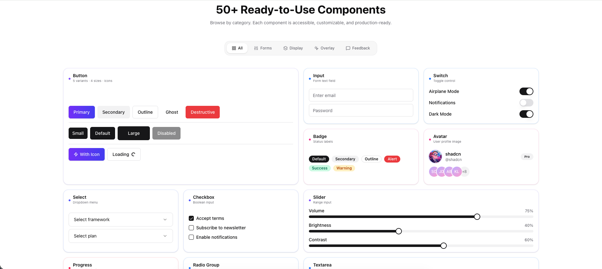

# ✦ Nexus UI

**A modern, zero-dependency component library built for Next.js**

 

[**View Docs**](https://nexus-ui.vercel.app/docs) · [**Components**](https://nexus-ui.vercel.app/docs/components) · [**Installation**](https://nexus-ui.vercel.app/docs/installation) · [**Changelog**](CHANGELOG.md)

 

---

## ✦ Overview

> **Nexus UI** is a handcrafted collection of 50+ production-ready components built on top of **Next.js 15**, **Tailwind CSS**, and **TypeScript** — with no Radix UI dependency. Every component is built from scratch, giving you complete ownership of the code.
